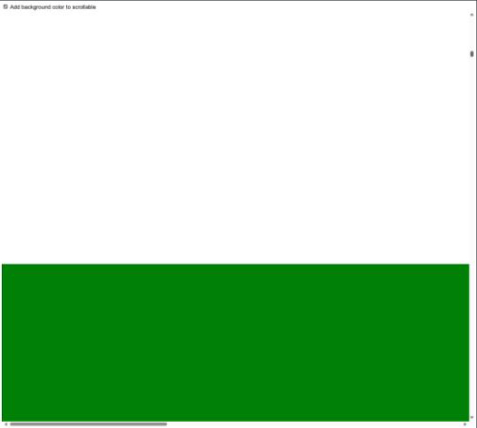

# smooth_native_scroll
Repro to demonstrate an\ user experience issue with user experience when doing smooth native scrolling. 

The demo implement a simple virtual scrolling experience inside a DOM element:
1. Block areas are added to the viewport dynamically based on the `scroll` event
2. The areas are in 3 colors - red, green, blue
3. DOM elements get removed when they exit the scrollable element viewport (to keep DOM size small)

(most logic is in `onViewportChange` function).

Try demo here: https://nhelfman.github.io/smooth_native_scroll/

**Issue**: during scrolling, white areas appear in the background although no white content was added to the DOM.
This is not always happening and depends on screen / display settings.

